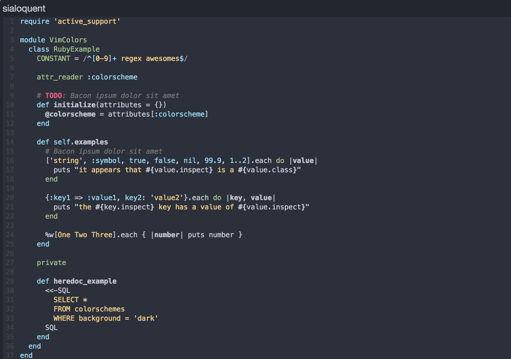

# Sialoquent

My favorite colorscheme

If you are using Macvim or Gvim you can make it even better by adding transparency: 
    
    set transparency=4    
    

### Setup in sceenshot

#### Font

Range Mono (https://pilgrimfonts.com/range-mono/)

    set linespace=8
    set guifont=Range\ Mono\ Light:h13

#### vim-gitgutter (https://github.com/airblade/vim-gitgutter)

Add to vimrc:

	let g:gitgutter_sign_modified = '•'
	let g:gitgutter_sign_added = '❖'
	highlight GitGutterAdd guifg = '#A3E28B'

#### lightline.vim (https://github.com/itchyny/lightline.vim)

Colorscheme: nord (https://github.com/arcticicestudio/nord-vim)

Add to vimrc
	
	set laststatus=2
	
	let g:lightline = {
      \ 'colorscheme': 'nord',
      \ 'active': {
      \   'left': [ [ 'mode', 'paste' ],
      \             [ 'fugitive', 'readonly', 'filename', 'modified' ] ]
      \ },
      \ 'component': {
      \   'readonly': '%{&filetype=="help"?"":&readonly?"⭤":""}',
      \   'modified': '%{&filetype=="help"?"":&modified?"+":&modifiable?"":"-"}',
      \   'fugitive': '%{exists("*fugitive#head")?fugitive#head():""}'
      \ },
      \ 'component_visible_condition': {
      \   'readonly': '(&filetype!="help"&& &readonly)',
      \   'modified': '(&filetype!="help"&&(&modified||!&modifiable))',
      \   'fugitive': '(exists("*fugitive#head") && ""!=fugitive#head())'
      \ },
      \ 'separator': { 'left': '', 'right': '' },
      \ 'subseparator': { 'left': '∿', 'right': '❂' }
      \ }

